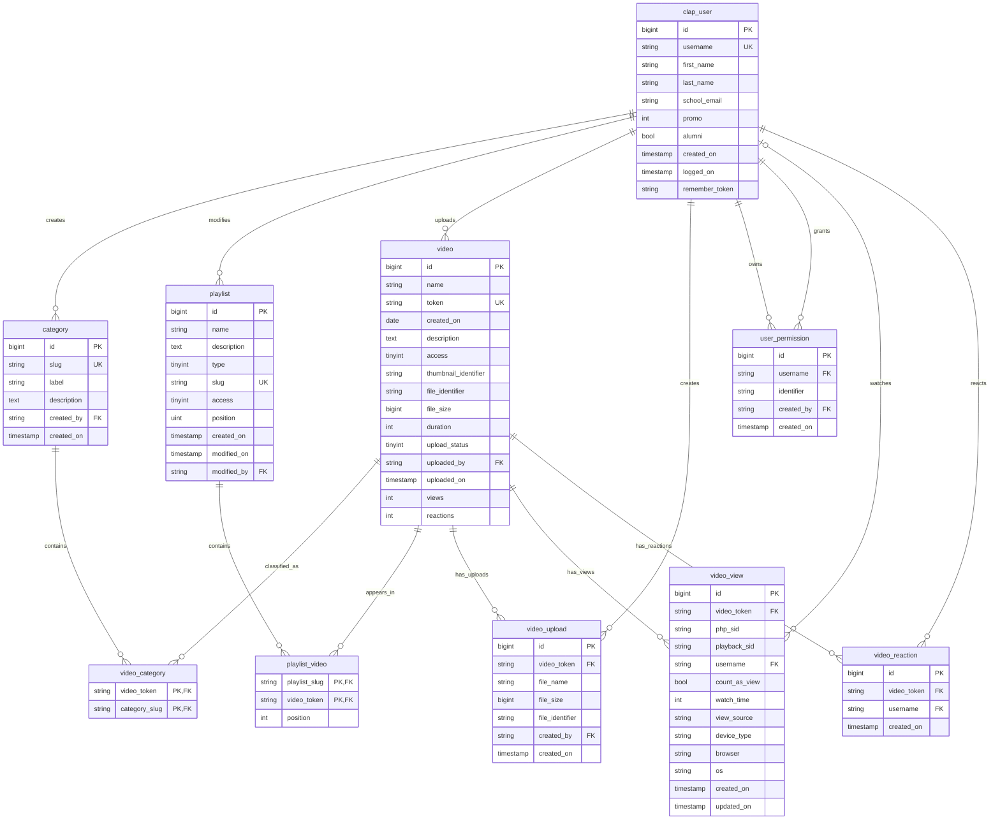

# MyCLAP


Site web de VOD du CLAP en Laravel : https://my.le-clap.fr

Cette V2 remise au goût du jour en 2026 du projet original de [Jean-Baptiste Caplan](https://github.com/jnbptstcpln/myclap)
a été développée par [David Marembert](https://github.com/D0gmaDev).

Le site est hébergé par l'[Association Rézoléo](https://github.com/rezoleo).

## Description

Ce site permet à travers différentes sections de :

- Uploder et publier des vidéos
- Classer les vidéos par catégorie
- Construire des playlists
- Permettre aux centraliens de s'authentifier avec leur compte CLA
- Définir la politique d'accès des vidéos et playlists :
  - **Publique** : n'importe qui peut y accéder
  - **Non répertoriée** : seules les personnes disposant du lien peuvent y accéder
  - **Centraliens** : tous les centraliens connectés via CLA peuvent y accéder
  - **Privée** : seuls les membres du CLAP autorisés peuvent y accéder
- Voir les statistiques de visionnage

## Installation

Après avoir récupéré le code depuis le repo GitHub :

```bash
composer install
npm install
npm run build
```

Copier le fichier `.env.example` en `.env` et configurer les variables d'environnement (base de données, Auth CLA, etc.).

Générer la clé d'application :

```bash
php artisan key:generate
```

Lancer les migrations :

```bash
php artisan migrate
```

Créer les liens symboliques pour le stockage :

```bash
php artisan storage:link
```

## Configuration Nginx

Exemple de configuration Nginx (il est très important que les fichiers statiques soient servis directement par Nginx) :

```nginx
server {
    listen 80;
    server_name localhost;

    root /var/www/myclap-v2/public;
    index index.php index.html index.htm;

    # Cache et service direct pour les fichiers statiques
    location ~* \.(jpg|jpeg|png|gif|ico|css|js|svg|woff|woff2|ttf|eot)$ {
        try_files $uri =404;
        expires 30d;
        add_header Cache-Control "public, immutable";
        access_log off;
    }

    # X-Accel-Redirect: location interne pour servir les fichiers depuis storage
    location ^~ /internal-storage/ {
        internal;
        alias /var/www/myclap-v2/storage/app/private/;
    }

    # Gestion des requêtes Laravel
    location / {
        try_files $uri $uri/ /index.php?$query_string;
    }

    # Gestion des fichiers PHP
    location ~ \.php$ {
        fastcgi_pass unix:/run/php/php8.4-fpm.sock;
        fastcgi_index index.php;
        fastcgi_param SCRIPT_FILENAME $document_root$fastcgi_script_name;
        include fastcgi_params;
    }

    # Sécurité : bloquer l'accès aux fichiers cachés
    location ~ /\.(?!well-known).* {
        deny all;
    }

    error_page 500 502 503 504 /50x.html;
    location = /50x.html {
        root /usr/share/nginx/html;
    }
}
```

Vérifier que l'utilisateur du serveur web ait les permissions en écriture sur les dossiers `storage` et `bootstrap/cache`.

## Configuration CLA Auth

Dans le fichier `.env`, configurer les paramètres pour l'authentification CLA :

```
CLA_AUTH_HOST=https://centralelilleassos.fr
CLA_AUTH_IDENTIFIER=myclap
```

## Schéma de la base de données


